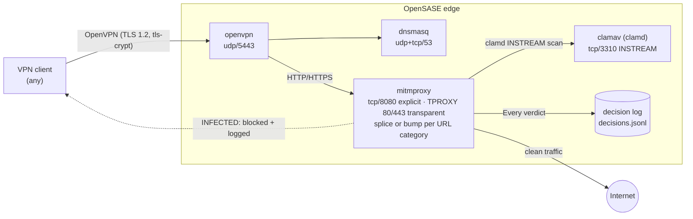

# OpenSASE

[](https://github.com/shsingh/opensase/blob/master/LICENSE)
[](https://github.com/shsingh/opensase/graphs/commit-activity)
[](https://libraries.io/github/shsingh/opensase)
[](https://results.pre-commit.ci/latest/github/shsingh/opensase/master)
[](https://api.securityscorecards.dev/projects/github.com/shsingh/opensase)
<!-- OpenSSF Best Practices: after registering opensase at https://www.bestpractices.dev, replace PROJECT_ID with the assigned number and uncomment.
[](https://www.bestpractices.dev/projects/PROJECT_ID)
-->

[](https://github.com/shsingh/opensase/actions/workflows/flake-check.yml)
[](https://github.com/shsingh/opensase/actions/workflows/release-images.yml)
[](https://github.com/shsingh/opensase/actions/workflows/pages.yml)
[](https://github.com/shsingh/opensase/actions/workflows/dependency-review.yml)
[](https://github.com/shsingh/opensase/releases)

Open, self-hosted **S**ecure **A**ccess **S**ervice **E**dge components built from OSS tooling, declared end-to-end with [Nix](https://nixos.org/).

OpenSASE is a TLS-inspection edge. Clients connect over OpenVPN; an mitmproxy addon decrypts and re-encrypts traffic per a URL-category policy; every payload is scanned by ClamAV; every verdict is written to a JSONL decision log.

Two deployment paths, one source of truth:

1. **Containers** — pull the Nix-built OCI images from GHCR and `docker compose up` on Linux, macOS, or Windows.
2. **Nix / NixOS appliance** — the same stack as stock NixOS modules: build a QEMU VM, `nixos-rebuild` a physical or remote host.

## Architecture



Verdict order: **passlist** (splice, no decrypt) → **bumplist** (decrypt + scan) → default bump. Every verdict — `splice`, `bump`, `clean`, `INFECTED` — is written to `/data/log/decisions.jsonl`. The cICAP layer of the original design was dropped; the addon speaks clamd's INSTREAM protocol directly.

## Release artifacts

All images are built by Nix — no Dockerfile builds. CI ([`.github/workflows/release-images.yml`](.github/workflows/release-images.yml)) builds each image with `dockerTools.buildLayeredImage` from the flake and pushes to GHCR on `v*` tags, with an SPDX SBOM per image:

- `ghcr.io/shsingh/opensase-dnsmasq` — DNS for VPN clients
- `ghcr.io/shsingh/opensase-clamav` — clamd scanner (DB bootstraps on first run, `SKIP_FRESHCLAM=1` to skip)
- `ghcr.io/shsingh/opensase-mitmproxy` — decrypt/re-encrypt core; addon + policy lists baked into the image
- `ghcr.io/shsingh/opensase-openvpn` — VPN server (config + certs supplied by you)

The same images build locally: `nix run .#load-images`.

## Releases

Releases are GPG-signed tags. The release workflow verifies the tag (`git tag -v`) and refuses to publish unsigned material:

```bash
git tag -s v0.1.0 -m "OpenSASE v0.1.0: initial Nix-built container release"
git push origin v0.1.0
```

CI matrix-builds the four images on Linux runners, publishes to GHCR (`:latest` + version), and opens a draft release with generated notes: image-digest table, commit changelog since the previous tag, SPDX SBOMs as assets, and a compose deploy snippet. Review and publish the draft.

## Quick start — Docker (no Nix required)

Any OCI runtime: Docker Engine / Docker Desktop on Linux, macOS, Windows, or Podman.

```bash
git clone https://github.com/shsingh/opensase && cd opensase
docker compose -p opensase up -d
```

The OpenVPN server requires a PKI before it starts:

```bash
# Option A: with Nix on the machine (one-time CA bootstrap into ./state/openvpn)
nix run .#vpn-init

# Option B: container-only bootstrap
# run EasyRSA in the openvpn image against a scratch mount, or supply your own
# server.conf + PKI into the `openvpn_priv` volume
```

Copy `./state/openvpn/*` into the `openvpn_priv` volume and restart the `openvpn` service. Point a client at `udp/5443` and an explicit proxy at `<host>:8080`.

## Quick start — Nix / NixOS

Install [Nix](https://nixos.org/download) on any Linux distribution, or run NixOS:

```bash
git clone https://github.com/shsingh/opensase && cd opensase

# 1. Bootstrap the OpenVPN CA + certs (gitignored ./state)
nix run .#vpn-init

# 2a. QEMU VM (Linux host):
nix build .#vm-x86_64 && ./result/bin/run-opensase-vm      # aarch64: .#vm-aarch64

# 2b. Real machine or remote host:
nixos-rebuild switch --flake .#opensase
nixos-rebuild switch --flake .#opensase --target-host root@<ip>

# 2c. Container stack from locally built images:
nix run .#load-images && docker compose -p opensase up -d
```

To add the edge to an existing NixOS host, import `nix/appliance.nix` — it composes stock modules (`services.clamav`, `services.dnsmasq`, `services.openvpn`) plus the `services.opensase` module.

## Kubernetes

Prebuilt cluster manifests are **not shipped yet**; the legacy k8s YAML was removed in favour of these images, and a follow-up will add kustomize overlays. The images are stateless OCI from `dockerTools` and stage cleanly on Kubernetes with the standard contract:

| Container | Image | Capabilities | Persistent volume |
|---|---|---|---|
| dnsmasq | `opensase-dnsmasq` | — | `RWO` for `/var/lib/misc` |
| clamav | `opensase-clamav` | — | `RWO` for `/var/lib/clamav` (signature DB) |
| mitmproxy | `opensase-mitmproxy` | — | `RWO` for `/data` (decision log) |
| openvpn | `opensase-openvpn` | `NET_ADMIN` | `RWO` for `/data-priv` (`server.conf` + PKI) |

Deployment requirements:

- **PKI distribution**: `server.conf`, `ca.crt`, `server.crt/key`, `ta.key` must exist under `/data-priv` before `openvpn` starts. Inject via Secret + pod `postStart` copy, or mount from a `SecurityContext`-protected volume. Current images check no paths; the k8s follow-up adds a strict readiness gate.
- **LoadBalancer / NodePort** for `udp/5443` (VPN) and `tcp/53` (DNS); mitmproxy `8080` is ClusterIP for explicit-proxy clients or ` LoadBalancer` for TPROXY testing.
- **Transparent mode on k8s: unsupported.** TPROXY policy routing inside a container network was unreliable in the original design and remains docker/compose-only as explicit proxy. On Kubernetes, run mitmproxy explicit (`8080`) behind a Service; transparent interception needs CNI-level support (e.g. a Layer 7 plugin or patched sidecar).
- **clamd scale**: one replica; the signature DB bootstraps on first start — attach a PVC to avoid re-download on restart.

## Module options

```nix
services.opensase.enable = true;
services.opensase.mitmMode = "regular";   # or "transparent" (TPROXY 80/443)
services.opensase.listenPort = 8080;
services.opensase.policyPass = ./my/pass.txt;
services.opensase.policyBump  = ./my/bump.txt;
services.opensase.decisionLog = "/var/lib/opensase/log/decisions.jsonl";
```

## Policy

- `nix/policy/pass.txt` — domains spliced through, never decrypted
- `nix/policy/bump.txt` — domains always decrypted and scanned

Both are `types.path` NixOS options, overridable at rebuild time. In the container images they are baked in per tag; to change policy, rebuild the image or mount your own lists into the `mitmproxy` container.

## Client setup

### Windows
- Copy the generated `.ovpn` profile into OpenVPN's config directory; connect as Administrator (the tunnel requires it).
- Trust the mitmproxy CA: double-click the `.crt`, install for the **current user**, into **Trusted Root Certification Authorities**. Chrome and Edge read this store; Firefox has its own (Settings → Certificates).

### macOS
- Import the profile into OpenVPN Connect or Tunnelblick; trust the mitmproxy CA in the System keychain.

### iOS
- OpenVPN Connect → import the `.ovpn`; CA: open the `.crt` from Files and trust it in the profile.

### Verify

With the tunnel up:

```bash
ping <appliance>          # tunnel reachable
curl -x http://<appliance>:8080 https://example.com   # explicit-proxy path
```

Download the [EICAR test file](https://www.eicar.org/download-anti-malware-testfile/) over HTTPS: the download is blocked and the decision log records `INFECTED`.

## Security notes

- One process per container; the appliance runs services under dedicated non-root users.
- The VPN CA lives in its own volume — protect it.
- TLS 1.2, elliptic-curve certificates, DHE, tls-crypt.
- **Not for production as-is** — this is a lab/testing appliance. TLS interception is a high-value target; review bump/splice policy before extending.

## Docs

Full documentation site (architecture, deployment, policy, CI): **https://shsingh.github.io/opensase/** — Quarto, built from `docs/`.

## Contributing & security

See [CONTRIBUTING.md](CONTRIBUTING.md) for branching, conventional signed commits, and the acceptance suite; [SECURITY.md](SECURITY.md) for reporting a vulnerability (never as a public issue); [CODE_OF_CONDUCT.md](CODE_OF_CONDUCT.md).

## Status

- [x] NixOS flake: appliance + QEMU VMs, `nix flake check --all-systems` clean
- [x] Nix-built OCI images for all four services + GHCR release workflow
- [x] Compose deployment for non-Nix users (Linux/macOS/Windows)
- [x] Quarto docs site → GitHub Pages
- [x] OpenSSF Scorecard workflow + badge (Best Practices registration manual, one-time)
- [ ] Kubernetes: kustomize overlays + readiness gate on the OpenVPN PKI
- [ ] First release: tag `v0.1.0` → images to GHCR + draft release
- [ ] VM closure build + boot smoke test (CI, linux runner)
- [ ] Live verdict verification (EICAR over HTTPS)
- [ ] Tofu provider shapes (hcloud/aws)

## Credits

Inspired by [@sweitzel](https://github.com/sweitzel)'s [docker-vpnbox](https://github.com/sweitzel/docker-vpnbox).

## License

[GPL-3.0](LICENSE) (inherited from the original project).
